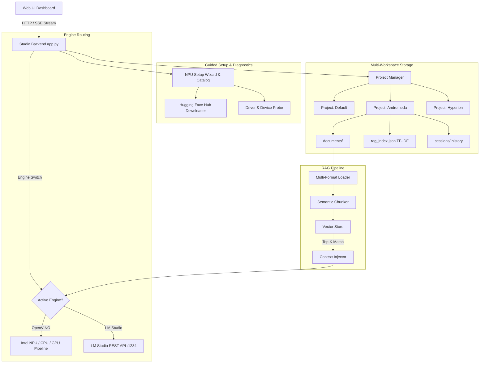

# ⚡ Antigravity AI Studio

> **High-Performance Local LLM & Project-Scoped RAG Studio powered by Intel® OpenVINO™ (NPU / CPU / GPU) and LM Studio with Guided NPU Setup Wizard.**

[](https://www.intel.com/content/www/us/en/developer/tools/openvino-toolkit/overview.html)
[](https://www.intel.com)
[](https://lmstudio.ai/)
[](https://scikit-learn.org/)
[](https://python.org)
[](LICENSE)

---

## 🌟 Overview

**Antigravity AI Studio** is a unified, privacy-first local AI workstation designed for running Large Language Models with **hardware acceleration on Intel Core Ultra NPUs** and seamless dual-engine integration with **LM Studio**.

It features an isolated **Project-Scoped Retrieval-Augmented Generation (RAG)** architecture, multi-session persistent chat history with sliding-window compaction, **Safe Conversation Memorization**, and a comprehensive **Interactive Intel NPU Setup Wizard** for automated hardware/driver diagnostics and 1-click model downloads.

```
+-----------------------------------------------------------------------------------------+
|                                ANTIGRAVITY AI STUDIO                                   |
+-----------------------------------------------------------------------------------------+
|  [💬 Direct Chat]           [📁 Projects Workspace]           [🕒 Searchable History]   |
+-----------------------------+---------------------------------+-------------------------+
|  Dual Engine Toggle:        |  Isolated Knowledge Bases:     |  Persistent Sessions:   |
|   ⚡ OpenVINO (Intel NPU)    |   • PDF, TXT, MD, CSV, Code     |   • Multi-turn restore  |
|   🦙 LM Studio (Port 1234)  |   • Sub-ms TF-IDF Vector Search |   • NPU Sliding Window  |
|                             |   • Safe Q&A Distillation       |   • Markdown Export     |
+-----------------------------+---------------------------------+-------------------------+
|  Guided NPU Wizard:         |  Reasoning Support:             |  UI / UX:               |
|   • Driver & Device Check   |   • DeepSeek-R1 Thinking Block  |   • Responsive Glass    |
|   • 1-Click Model Download  |   • Interactive Citation Pills  |   • Global Drag & Drop  |
|   • Live Benchmark Test     |   • Live Tokens/Sec & TTFT      |   • Cyberpunk Aesthetic |
+-----------------------------------------------------------------------------------------+
```

---

## 🚀 Key Features

### 1. ⚡ OpenVINO™ NPU Acceleration & Guided Setup Wizard
- Native execution on **Intel® AI Boost NPU** via `openvino_genai.LLMPipeline`.
- Zero CPU/dGPU power draw during generation with static KV-cache optimization (`MAX_PROMPT_LEN: 1024`, `GENERATE_HINT: BEST_PERF`).
- **Interactive NPU Setup Wizard**:
  - **Automated Diagnostics**: Verifies CPU architecture, NPU driver readiness, and OpenVINO runtime status.
  - **1-Click Model Acquisition Catalog**: Download verified INT4 OpenVINO models (*Llama 3.2 3B*, *DeepSeek-R1 Distill 1.5B*, *TinyLlama 1.1B*, *Phi-4 Mini 3.8B*) directly from Hugging Face with live progress feedback.
  - **Live Dry-Run Benchmark**: Validates compilation, warm-up latency, and output tokens before starting a full session.

### 2. 🦙 LM Studio Local Server Integration
- Connects automatically to local LM Studio instances on `http://127.0.0.1:1234/v1`.
- Auto-detects and enumerates loaded models (e.g. `deepseek-r1-0528-qwen3-8b`, `qwen3.5-9b`, `gemma-4-12b-qat`).
- Native streaming of **Reasoning / Thought Process** tokens into collapsible interactive UI cards.

### 3. 📁 Project-Scoped RAG Architecture
- **Zero Context Pollution**: Documents uploaded to Project A are strictly isolated from Project B.
- **Multi-Format Parsers**: PDF (binary & text), TXT, Markdown, CSV, JSON, Python, C++, and log files.
- **Clickable Citation Chips**: Displays exact source file matches, percentage similarity scores, and expandable snippet previews.

### 4. 🧠 Safe Conversation Memorization (Anti-Hallucination)
- Distills concluded chat sessions into clean Q&A insight documents.
- Strips conversational pleasantries and filler to avoid polluting the vector database.
- Provides an **editable review modal** before indexing memories into the project knowledge base.

### 5. 🕒 Persistent Multi-Session Chat History
- Chronological, searchable timeline of all previous conversations.
- 1-click continuation restores complete conversation threads, citations, and metrics.
- Automatic sliding-window compaction preserves system prompts and recent context without overflowing the NPU buffer.

---

## 🏗️ System Architecture



---

## 💻 Hardware Requirements

| Component | Minimum | Recommended |
|---|---|---|
| **Processor** | Intel® Core™ Ultra (Meteor Lake / Lunar Lake / Arrow Lake) | Intel® Core™ Ultra 7 / 9 with Intel® AI Boost NPU |
| **RAM** | 16 GB | 32 GB LPDDR5x / DDR5 |
| **OS** | Windows 11 (64-bit) / Linux (Ubuntu 22.04+) | Windows 11 23H2+ with latest Intel NPU Drivers |
| **Intel NPU Driver** | 32.0.100.3104+ | Latest [Official Intel NPU Driver](https://www.intel.com/content/www/us/en/download/794734/intel-npu-driver-windows.html) |
| **Optional dGPU** | NVIDIA RTX 3060+ | NVIDIA RTX 4070 / 5070 Ti (for dual-engine setups) |

---

## 📦 Installation & Quickstart

### Step 1: Clone Repository
```bash
git clone https://github.com/subhojitp76/antigravity-ai-studio.git
cd antigravity-ai-studio
```

### Step 2: Create Python Environment
```bash
python -m venv venv

# Windows
.\venv\Scripts\activate

# Linux / macOS
source venv/bin/activate
```

### Step 3: Install Dependencies
```bash
pip install -r requirements.txt
```

### Step 4: Model Acquisition (In-App Wizard or Manual)
- **Option A (Recommended - 1-Click In-App Wizard)**: Start the app, open the **NPU Setup Wizard (⚡)** from the top bar, and click **Download** on any verified INT4 model (*Llama 3.2 3B*, *DeepSeek-R1 1.5B*, *TinyLlama 1.1B*, *Phi-4 Mini 3.8B*).
- **Option B (CLI Conversion via Optimum Intel)**:
  ```bash
  pip install optimum-intel[openvino]
  optimum-cli export openvino --model meta-llama/Llama-3.2-3B-Instruct --weight-format int4 llama-3.2-3b-ov
  ```

---

## 🎯 Running the Studio

### Windows (One-Click Batch)
Double-click `start_app.bat` or run:
```cmd
start_app.bat
```

### Linux / macOS
```bash
chmod +x start_app.sh
./start_app.sh
```

### Python CLI Options
```bash
# Start server on default port 7860
python app.py

# Custom port without auto-opening browser
python app.py --port 8080 --no-browser
```

Open your browser at **`http://localhost:7860`**.

---

## 📡 API Endpoints Reference

| Method | Endpoint | Description |
|---|---|---|
| `GET` | `/api/npu/diagnostics` | Full NPU hardware, driver, and active model integrity diagnostic report |
| `GET` | `/api/npu/catalog` | List of pre-verified INT4 OpenVINO models for 1-click installation |
| `GET` | `/api/npu/download_status` | Polling endpoint for active background model downloads |
| `POST` | `/api/npu/download` | Trigger asynchronous download of an INT4 model from Hugging Face Hub |
| `POST` | `/api/npu/test` | Run live dry-run NPU pipeline compilation and latency benchmark |
| `POST` | `/api/npu/set_model_path` | Validate and switch active OpenVINO model directory |
| `GET` | `/api/engine/status` | Current engine mode, NPU state, and LM Studio connectivity |
| `POST` | `/api/engine/select` | Switch active engine (`openvino` vs `lmstudio`) |
| `GET` | `/api/projects` | List all project workspaces with document and session stats |
| `POST` | `/api/projects/create` | Create a new isolated project workspace |
| `POST` | `/api/projects/select` | Switch active project context |
| `POST` | `/api/projects/delete` | Delete project workspace and its vector store |
| `GET` | `/api/sessions` | List saved conversations (optionally filtered by `?project_id=`) |
| `POST` | `/api/sessions/save` | Save or update conversation transcript |
| `GET` | `/api/sessions/load?id=` | Load full conversation turns and citations |
| `POST` | `/api/sessions/distill` | Strip pleasantries and generate structured Q&A summary |
| `POST` | `/api/sessions/memorize` | Index distilled conversation into project RAG |
| `GET` | `/api/documents?project_id=` | List indexed files in the specified project |
| `POST` | `/api/documents/upload` | Upload & chunk document (supports Base64 binary & text) |
| `POST` | `/api/documents/delete` | Remove file and update project vector store |
| `POST` | `/api/chat/stream` | Multi-engine SSE streaming endpoint with RAG context injection |

---

## 🧪 Automated Test Suite

Run the full automated test suite to verify NPU diagnostics, guided wizard endpoints, LM Studio streaming, RAG vector retrieval, and session resumption:

```bash
# Test 1: Intel NPU Guided Setup, Diagnostics & Model Catalog
python test_npu_setup.py

# Test 2: Project-Scoped RAG, Sessions & Memorization
python test_projects_and_history.py

# Test 3: LM Studio Dual-Engine Streaming & Reasoning
python test_lmstudio_integration.py

# Test 4: OpenVINO NPU RAG Pipeline Verification
python test_rag_pipeline.py
```

---

## 📄 License

This project is licensed under the **Apache License 2.0**. See the [LICENSE](LICENSE) file for details.
